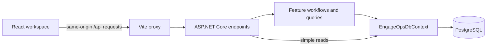

# Architecture

EngageOps is a feature-oriented modular monolith. One ASP.NET Core API project owns
the backend, and one React application provides the browser workspace. PostgreSQL
stores application and Identity data through one EF Core context.

## Repository layout

| Location                                                                    | Responsibility                                             |
| --------------------------------------------------------------------------- | ---------------------------------------------------------- |
| [`src/backend/EngageOps.Api`](../src/backend/EngageOps.Api)                 | API host, feature code, Identity and persistence           |
| [`src/frontend/src`](../src/frontend/src)                                   | React application and colocated frontend tests             |
| [`src/frontend/e2e`](../src/frontend/e2e)                                   | Playwright browser journeys, fixtures and disposable stack lifecycle |
| [`tests/backend/EngageOps.Api.Tests`](../tests/backend/EngageOps.Api.Tests) | Backend domain, mapping, persistence and HTTP tests        |
| [`scripts`](../scripts)                                                     | PowerShell entry point for development seed/reset commands |
| [`compose.yaml`](../compose.yaml)                                           | Local PostgreSQL, backend and frontend services            |
| [`compose.e2e.yaml`](../compose.e2e.yaml)                                   | Isolated PostgreSQL and API for browser tests               |
| [`.github`](../.github)                                                     | CI, CodeQL and dependency monitoring configuration         |

Backend domain and application boundaries are organised by feature within the API
project. The solution contains the API project and its test project.

## Backend responsibilities

| Feature/folder    | Owns                                                                                                         |
| ----------------- | ------------------------------------------------------------------------------------------------------------ |
| `Identity`        | Application users, account provisioning, cookie authentication, session endpoints and antiforgery validation |
| `Organisations`   | Organisations, memberships, organisation provisioning and membership checks                                  |
| `Clients`         | Client entity, creation workflow, listing/creation endpoints and EF mapping                                  |
| `Workers`         | Worker entity, creation workflow, listing/creation endpoints and EF mapping                                  |
| `Assignments`     | Assignment entity, creation/cancellation workflows, list/detail queries, endpoints and EF mapping            |
| `Persistence`     | `EngageOpsDbContext`, EF migrations and model snapshot                                                       |
| `Http`            | Shared pagination validation and limits                                                                      |
| `DevelopmentData` | Development-only command handling, dataset catalogue and seed/reset workflow                                 |

[`Program.cs`](../src/backend/EngageOps.Api/Program.cs) configures dependency
injection, authentication, errors, migrations and endpoint registration. Minimal API
endpoints handle HTTP concerns and translate application results into response DTOs.
Entity factories and methods enforce domain rules. Creation/cancellation workflows
and assignment queries have explicit owners; simple list queries also live directly
in their feature endpoints.

EF Core is used directly. Feature configuration classes map entities into the shared
[`EngageOpsDbContext`](../src/backend/EngageOps.Api/Persistence/EngageOpsDbContext.cs),
which derives from `IdentityUserContext<ApplicationUser, Guid>`. The API returns
dedicated response contracts, and database I/O uses asynchronous EF operations with
cancellation tokens.

## Request flow

The local Compose request path is:

For example, client creation starts in `ClientCreationForm`, calls `useCreateClient`
and the clients API adapter, obtains an antiforgery token, and posts a name to the
organisation-scoped endpoint. The endpoint checks authentication/antiforgery and
input, then `ClientCreator` validates membership and persists the domain entity.
The frontend invalidates that user/organisation's client queries and presents the
result with focus restoration and success feedback.

## Tenant and authentication boundaries

Users can belong to multiple organisations through `OrganisationMembership`.
Authorisation is membership-based. Tenant-scoped operations explicitly check
membership and constrain their queries by organisation; isolation does not depend
on a global EF query filter. Missing and inaccessible organisations produce the same
404 response to avoid revealing other tenants.

ASP.NET Core Identity issues HttpOnly, SameSite=Lax application cookies. Cookies
require HTTPS outside Development. Sign-in uses lockout protection and returns the
same failure for unknown accounts, incorrect passwords and locked accounts.

Mutations, including sign-in and registration, require the antiforgery cookie and a
request token sent in `X-CSRF-TOKEN`. `/api/auth/csrf` supplies that token. Protected
endpoints use authentication requirements, with 401/403 ProblemDetails responses
instead of login-page redirects. Validation failures use validation ProblemDetails.

Registration provisions the user, organisation and first membership in one database
transaction. The database username index also arbitrates concurrent duplicate-account
creation. The frontend reads `/api/auth/session`; a 401 from protected feature
operations triggers a session recheck.

## Domain and persistence

Organisations have a name. Clients and workers each have a name and organisation ID.
Assignments link an organisation, client and worker with a start date, optional end
date and status. Entity/user IDs are generated as UUIDv7 values in application code.

Assignments start as `Confirmed`. Cancellation changes the status to `Cancelled`;
repeating the cancellation API call returns success. Domain validation rejects an
end date before the start date.

The assignment EF mapping adds matching database checks for date ranges and allowed
statuses. Composite `(organisation_id, client_id)` and `(organisation_id, worker_id)`
foreign keys ensure both related records belong to the assignment's organisation.
Restricted foreign-key deletion protects operational relationships. See
[`AssignmentConfiguration.cs`](../src/backend/EngageOps.Api/Assignments/AssignmentConfiguration.cs).

Clients and workers are paginated in name/ID order. Assignments use start date
descending, then ID, with a corresponding database index. The shared
[`Pagination`](../src/backend/EngageOps.Api/Http/Pagination.cs) defaults to 50 items
and caps page size at 100; the client UI explicitly requests 20.

## Frontend responsibilities

[`main.tsx`](../src/frontend/src/main.tsx) installs React Router and the shared
TanStack Query client. `App.tsx` handles session state and authenticated routes:
`/organisations` and `/organisations/:organisationId/clients`.

- `features/auth`, `features/organisations` and `features/clients` colocate components,
  API adapters, query/mutation hooks and behaviour tests.
- `components` contains the shared application shell and wordmark.
- `lib` contains HTTP errors, response guards, validation-error parsing and
  antiforgery token access.
- `index.css` defines the visual foundation; component classes implement responsive
  layout, focus indicators and reduced-motion behaviour.

TanStack Query owns server state. Organisation queries include the user ID; client
queries include the user, organisation and page. Form visibility and pagination
selection are local UI state. API adapters own `fetch` calls, handwritten TypeScript
contracts and runtime response validation. The sign-in and client-creation forms
use custom accessible validation, linked field errors and pending/error feedback.

See [Testing](testing.md) for checks around these boundaries and
[Local development](local-development.md) for runtime configuration.
